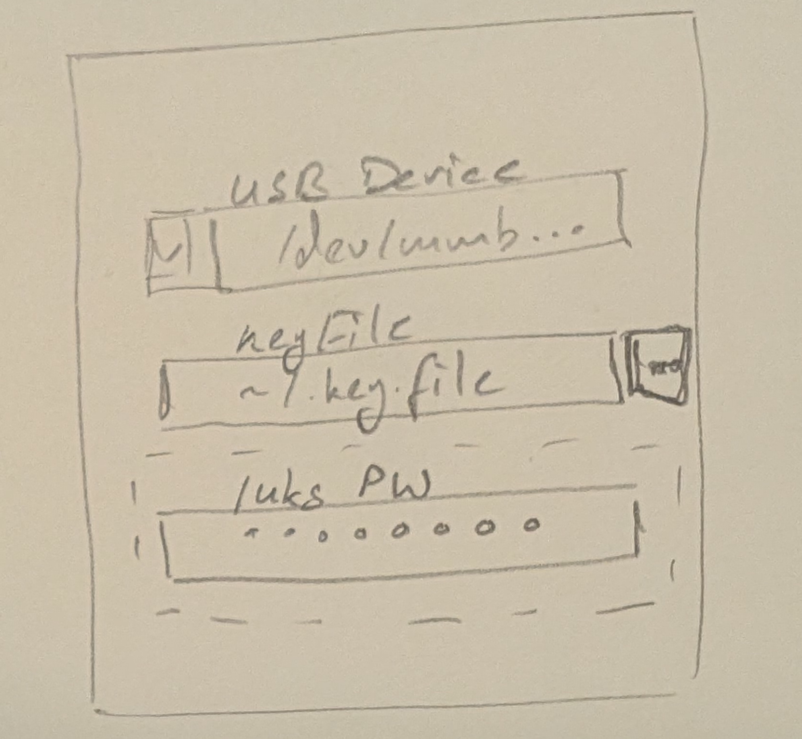
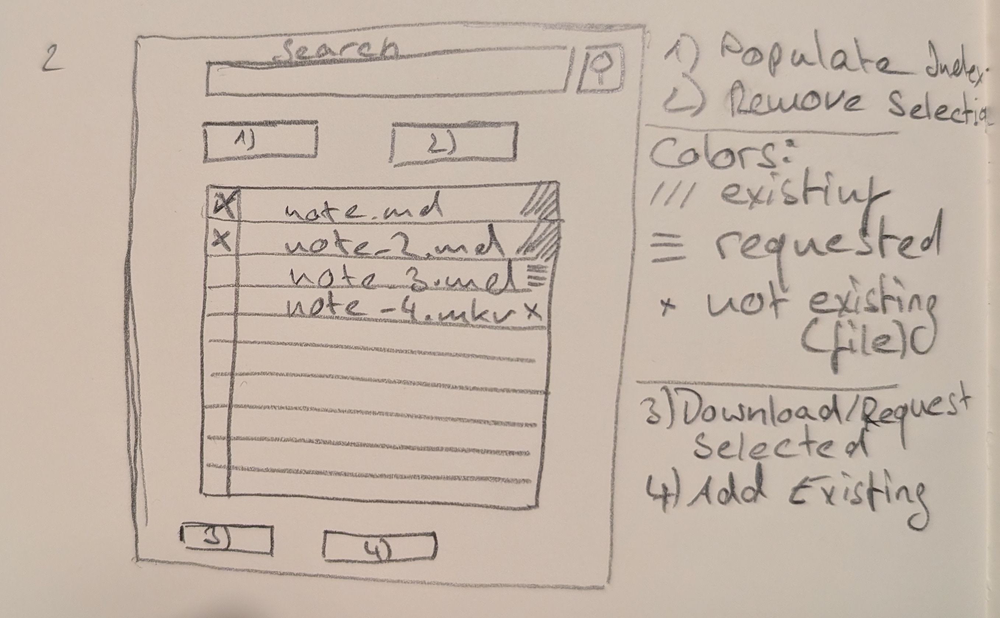
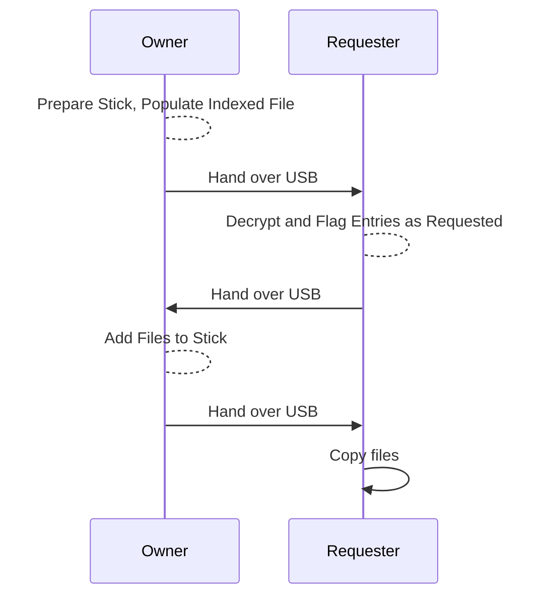

# Content

# Context

Once upon a time, I was waiting for the train together with my study mate.
As we were waiting for the exceedingly late train (thanks DB) we discussed
how to share our latest notes from the recent lecture securely.
As we both have a lot of notes we pictured to have
the possibility to choose which notes to exchange,
as the notes altogether were to much to transfer at once.
Various ideas utilizing VPN came up, but nothing stood out.

Today I am looking for a new (fun) project to torture myself with, preferably with a new programming language. Since I watched 'ThePrimeagen' the words 'skill issue' in combination with 'rust' are stuck in my head. Rust has so many features that writing code can get complicated fast (in my opinion)...

# To consider

After some brainstorming and consideration of things I want to try in Rust, here is a rough outline of things I want to consider:

- **Avoidance of the internetz**:
There is no need to transfer the file via the webs, as the transfer speed via USB is faster and direct access to the files is not needed
- **encryption, encryption, encryption**:
The words 'secure' and 'encryption' go well together
- **Dialog driven**:
The application might be used by less techy people, so a terminal application seems impractical
- **Tests**:
They always makes sense for code quality

# First ideas on UI and usage
As a visualistic thinking person, a first drawing helps me a long way in designing the application flow.

After inserting the USB Device the application should be startet to manage the device.
Selection of the USB Device, the keyfile for opening the vault and maybe another layer of luks encryption via password.

It is yet unclear to me:
- Is encryption stacking even useful
- Which encryption algorithm/type to be used
- Considerations of initialising a vault

After the vault is opened the following dialog should open (in case the keys are correct)

The main Dialog should revolve around the decrypted indexing file, which is basicly a list of all files that are of interest for exchanging.
The application should allow adding entries to the list, request files in the list from the other party and copying files from and to the store.

Basicly the use case would be:

# Where to go from here
As this is a quite large project for a Rust beginner, I will take my time and do some work on the idea from time to time. 
So follow the 'sef' tag to get all updates (if existing).
